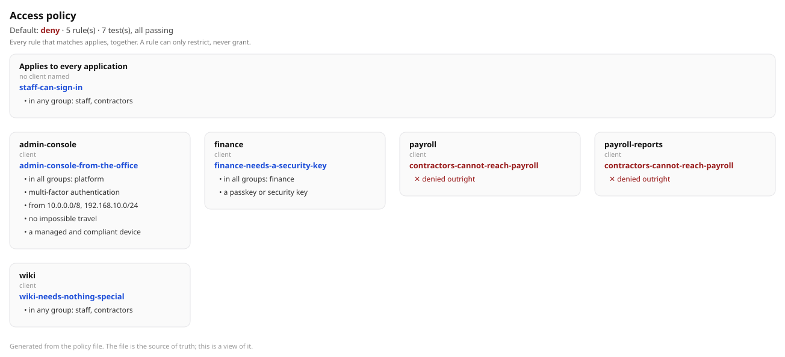

# Seeing the policy: a diagram generated from the file

```sh
signari policy graph -policy-file policy.yaml -out policy.svg
```

```
wrote policy.svg
  5 rule(s) -- 4 restricting, 1 denying
  7 test(s), all passing (a file whose tests fail does not load)
```




## The trade, stated plainly


This is the opposite trade:


The picture cannot drift from the behaviour, because it is not a second
representation — it is a rendering of the first one, produced from the same
parsed structure the engine evaluates. A builder has the opposite property, and
that is where "the diagram says one thing and production does another" comes
from.

The cost is real and worth naming: you cannot assemble a policy by dragging
boxes. You write nine lines of YAML and its tests.

## The layout is a claim, and the first one was wrong

The first version laid the client groups in a row with arrows between them. It
rendered cleanly and it was a lie: **arrows mean sequence, and there is no
sequence.** A request names one client, and what applies is the universal rules
*plus* that client's rules — together, not in order.

So the universal rules are a band across the top, the clients sit in a grid
beneath, and nothing points at anything.

Getting this wrong in a diagram is the same failure as getting it wrong in code,
and harder to notice, because a tidy diagram is assumed to be right. It was
found by rendering it and looking, which no test would have done.

## A condition that is enforced and not drawn

That is a lie of omission: somebody reads the diagram, sees no device
requirement, and cannot work out why their login is refused.

`TestEveryConditionIsDrawn` walks the `Conditions` struct by reflection, sets
each field alone, and fails when one draws nothing:

```
Conditions.DeviceCompliant is enforced and draws nothing. Somebody reads the
diagram, sees no such requirement, and cannot work out why their login is
refused.
```

It also fails if the test itself leaves a new field unset — otherwise adding a
field would make the test pass while proving nothing about it.

An earlier version asserted particular phrases and failed the moment the wording
improved from "phishing-resistant factor" to "a passkey or security key", which
is what an operator should actually read. **A test that pins prose makes the
prose worse.** It now checks that each condition changes the output, not what it
says.

## Deterministic, and no JavaScript

Plain SVG, laid out in Go. Two runs over the same file are byte-identical, so
the diagram can be committed and its diff read. Clients are sorted for the same
reason.

It renders in a browser, in a README, in a pull request comment, and in any
terminal that can show an image. Nothing is fetched, nothing executes.

Rule names are operator-supplied text going into markup, so they are escaped —
tested with a rule literally named `break <svg> & "quotes"`.

## Text that fits

Truncation is measured against the pixel width available rather than a fixed
character count. The first version cut at 30 characters regardless, turning
`contractors-cannot-reach-payroll` — the name that says what the rule does —
into `contractors-cannot-reach-payr…` while a third of the card sat empty.

## Drawn only for a file that would load

`policy graph` parses rather than reads, and parsing runs the file's own tests.
A policy whose tests fail cannot be drawn, because putting a picture of
something that cannot deploy in front of a reviewer is worse than showing them
nothing.

## Not in the console

Deliberately, for now. The CLI writes a file you commit, attach to a pull
request, or paste into a review — which is where the argument about a policy
actually happens. A console page showing the *live* policy is worth adding and
is a different job: it needs to say which version is loaded and when, or it
becomes another thing that can silently disagree with production.
